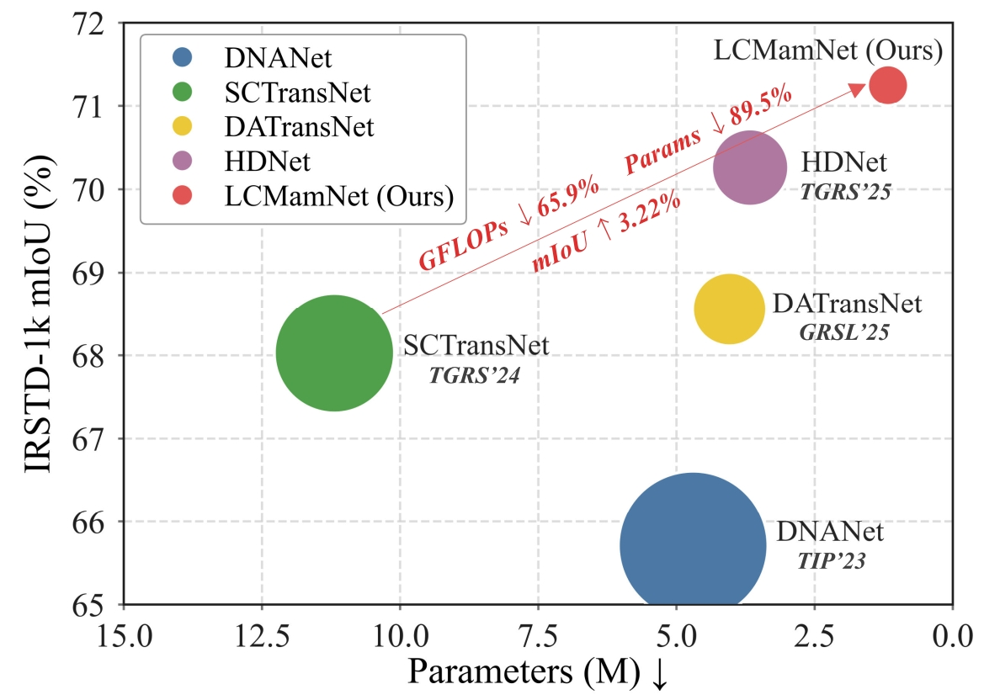

# LCMamNet: A Lightweight Cross-scale Mamba Network for Infrared Small Target Detection

**[Checkpoints](#checkpoints)** · [Environment](#environment) · [Training](#training) · [Test](#test)

LCMamNet is a lightweight segmentation-based framework for infrared small target detection (IRSTD). It combines a compact direction-aware encoder, latent dense cross-scale fusion with bidirectional Mamba modeling, and selective shallow-detail restoration for efficient and accurate small-target segmentation.

<p align="center">
  
</p>


## Highlights

- **Lightweight IRSTD framework:** 1.175M parameters and 6.91 GFLOPs under the 256 x 256 input setting.
- **Latent Dense Cross-scale Fusion (LDCF):** models cross-scale dependencies in a unified latent sequence and reorganizes the interacted representation into stable hierarchical features.
- **Cross-shaped Directional Bottleneck Residual (CDBR) encoder:** enhances direction-sensitive weak-target structures with low computational overhead.
- **Selective shallow-detail restoration:** regulates shallow skip features to recover useful details while suppressing background texture interference.
- **Edge deployment evaluation:** tested on NVIDIA Jetson Orin NX 16G SUPER.

## Results

Quantitative results are reported on three public IRSTD benchmarks.

| Dataset | mIoU (%) | Pd (%) | Fa (1e-6) |
| --- | ---: | ---: | ---: |
| IRSTD-1k | 71.25 | 93.20 | 11.31 |
| NUAA-SIRST | 79.60 | 100.00 | 0.71 |
| NUDT-SIRST | 95.58 | 99.47 | 3.38 |

Model efficiency (Latency tested under RTX 4090 24G):

| Params (M) | FLOPs (G) | Latency (ms) |
| ---: | ---: | ---: |
| 1.175 | 6.91 | 6.62 |

Jetson deployment on NVIDIA Jetson Orin NX 16G SUPER:

| Backend | Precision | Input | mIoU (%) | Latency (ms) | FPS |
| --- | --- | --- | ---: | ---: | ---: |
| PyTorch | FP32 | 1 x 1 x 256 x 256 | 71.27 | 49.86 | 20.06 |
| PyTorch | FP16 | 1 x 1 x 256 x 256 | 71.18 | 47.05 | 21.25 |
| TensorRT | FP16 | 1 x 1 x 256 x 256 | 65.96 | 9.75 | 102.60 |

## Environment

LCMamNet relies on the official [Mamba](https://github.com/state-spaces/mamba)
selective-scan CUDA kernels and therefore requires an NVIDIA GPU (CPU execution is not
supported). Tested with Python 3.12, PyTorch 2.4.0 (CUDA 11.8).

```bash
# 1. Create the environment
conda create -n LCMamNet python=3.12 -y
conda activate LCMamNet

# 2. PyTorch 2.4.0 (CUDA 11.8)
pip install torch==2.4.0+cu118 torchvision==0.19.0+cu118 --index-url https://download.pytorch.org/whl/cu118

# 3. causal-conv1d and mamba-ssm — install the prebuilt wheels from their official
#    releases (building from source via plain `pip install` is extremely slow and often
#    fails). The wheels below match Python 3.12 / torch 2.4 / CUDA 11.x / cxx11abiFALSE
#    (PyTorch's official wheels are built with cxx11abiFALSE).
pip install https://github.com/Dao-AILab/causal-conv1d/releases/download/v1.5.4/causal_conv1d-1.5.4+cu11torch2.4cxx11abiFALSE-cp312-cp312-linux_x86_64.whl
pip install https://github.com/state-spaces/mamba/releases/download/v2.3.0/mamba_ssm-2.3.0+cu11torch2.4cxx11abiFALSE-cp312-cp312-linux_x86_64.whl

# 4. Remaining runtime dependency
pip install scikit-image
```

For a different Python / PyTorch / CUDA combination, pick the matching wheels from the
release pages: [causal-conv1d releases](https://github.com/Dao-AILab/causal-conv1d/releases) and [mamba releases](https://github.com/state-spaces/mamba/releases).

> A `requirements.txt` is included as a reference snapshot of the verified environment,
> but installing with `pip install -r requirements.txt` is **not recommended**: the
> `causal-conv1d` and `mamba-ssm` CUDA extensions must match your exact Python / PyTorch /
> CUDA / C++ ABI, so follow the steps above and use the prebuilt release wheels instead.

## Dataset Preparation

The experiments use three public datasets: IRSTD-1k, NUAA-SIRST, and NUDT-SIRST.
Organize each dataset as follows (the split files list one image id per line, without
file extension; images and masks share the same `<id>.png` filename):

```text
datasets/
└── <DATASET>/
    ├── images/        # <id>.png  input infrared images
    ├── masks/         # <id>.png  binary target masks
    └── split/
        ├── train.txt
        └── test.txt
```

`<DATASET>` is one of `IRSTD-1k`, `NUAA-SIRST`, `NUDT-SIRST`. This repository ships two
sample image/mask pairs per dataset together with the full split lists as a format
reference; download the complete datasets to reproduce the reported results. See
[`datasets/README.md`](datasets/README.md) for details and source links.

## Checkpoints

Pretrained checkpoints are included in this
repository under `weights/`, so cloning the repo or downloading the source ZIP already
gives you all three. The links below are only for downloading an individual checkpoint on
its own:

| Dataset | Checkpoint | mIoU (%) |
| --- | --- | ---: |
| IRSTD-1k | [LCMamNet_irstd1k.pt](https://github.com/Haoyu096/LCMamNet/raw/main/weights/LCMamNet_irstd1k.pt) | 71.25 |
| NUAA-SIRST | [LCMamNet_nuaa.pt](https://github.com/Haoyu096/LCMamNet/raw/main/weights/LCMamNet_nuaa.pt) | 79.60 |
| NUDT-SIRST | [LCMamNet_nudt.pt](https://github.com/Haoyu096/LCMamNet/raw/main/weights/LCMamNet_nudt.pt) | 95.58 |

Load a checkpoint manually:

```python
import torch
from models.LCMamNet import LCMamNet

model = LCMamNet(n_channels=1, n_classes=1)
state_dict = torch.load("weights/LCMamNet_irstd1k.pt", map_location="cpu", weights_only=True)
model.load_state_dict(state_dict)
model.eval()
```

## Training

A single `train.py` handles all datasets. 
Override any hyperparameter with `--key value`.

```bash
python train.py                        # IRSTD-1k (default)
python train.py --dataset NUAA-SIRST
python train.py --dataset NUDT-SIRST

# example overrides
python train.py --dataset IRSTD-1k --epochs 800 --lr 1e-3 --train_batch_size 12
```

Checkpoints are written to `runs/train/<name>/weights/` as `best.pt` and `last.pt` , with the run config saved alongside as `args.yaml`.

## Test

`test.py` defaults to IRSTD-1k with its released weights.  Override `--weights`, `--dataset`, or `--device` as needed.

```bash
python test.py                                                    # IRSTD-1k (default)
python test.py --dataset NUAA-SIRST --weights weights/LCMamNet_nuaa.pt
python test.py --dataset NUDT-SIRST --weights weights/LCMamNet_nudt.pt
python test.py --dataset IRSTD-1k --weights runs/train/lcmamnet/weights/best.pt
```

Both `train.py` and `test.py` accept `--key value` overrides for every entry in their
`DEFAULTS` block (e.g. `--dataset`, `--weights`, `--device`, `--epochs`, `--lr`,
`--train_batch_size`, `--batch_size`, `--workers`). Run with `--show_config` to print the
resolved configuration.

## TensorRT Deployment

Deployment was evaluated on an **NVIDIA Jetson Orin NX 16G SUPER** (`CUDA_ARCH_BIN=8.7`)
under the MAXN power mode; the paper reports TensorRT FP16 results in the
[Results](#results) section.

The Jetson runs on `aarch64` with Python 3.8, so it needs the ARM builds of the Mamba
kernels rather than the x86-64 wheels used above. The environment setup is otherwise the
same as the [Environment](#environment) section — create a Python 3.8 environment with a
Jetson PyTorch build, then install the Mamba kernels.

Building `causal-conv1d` and `mamba-ssm` from source on a Jetson is slow and error-prone,
so to help other researchers reproduce and deploy more easily we provide two prebuilt
`aarch64` wheels on the [Releases](../../releases) page:

- `causal_conv1d-1.4.0-cp38-cp38-linux_aarch64.whl`
- `mamba_ssm-2.2.2-cp38-cp38-linux_aarch64.whl`

If your Jetson hardware and software stack (JetPack / Python 3.8 / the corresponding
PyTorch build) match ours, these wheels can be installed directly for a fast, convenient
setup. If your environment differs, build the kernels from source to match your own
Python / PyTorch / CUDA versions.

```bash
pip install causal_conv1d-1.4.0-cp38-cp38-linux_aarch64.whl
pip install mamba_ssm-2.2.2-cp38-cp38-linux_aarch64.whl
```

With the kernels in place, export the model to ONNX and build a TensorRT FP16 engine with
`trtexec` on the device.

## Repository Structure

```text
LCMamNet/
├── models/LCMamNet.py     network definition (CDBR encoder + LDCF Bi-Mamba fusion + progressive decoder)
├── core/                  training engine, weight loading, device resolution, warmup scheduler
├── data/                  dataset loaders and split utilities
├── losses/                BCE + soft-IoU loss
├── metrics/               mIoU / nIoU / Pd / Fa metrics
├── config/                CLI argument parsing
├── train.py               unified training entry (select dataset with --dataset)
├── test.py                evaluation (mIoU / Pd / Fa + latency)
├── weights/               released checkpoints (weights only)
└── datasets/              sample images/masks + full split lists
```

## Citation

If this work is useful for your research, please cite our paper.

```bibtex
TODO
```

